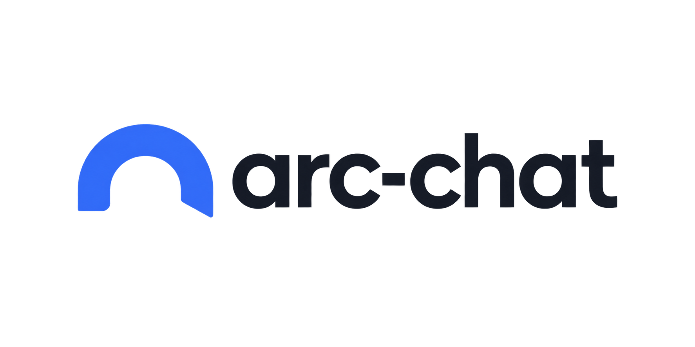

# ARC Research Chat

One self-contained HTML interface plus a local Python browser/Jupyter helper. The helper opens a separate Chromium window for VT login/MFA; no VT passwords are entered into the chatbot. VPN must be enabled using your normal client.

## Contributors

ARC Chat was created by **William Taggart**. **Alejandro Grenier** is a major development contributor across the current architecture, reliability/security hardening, Windows and cross-platform packaging, Student Mode onboarding/UX, automated testing, and Advanced ARC workflows including Slurm and managed vLLM. See [`CONTRIBUTORS.md`](CONTRIBUTORS.md) and the Git history for attribution details.

## Downloads

[Windows bootstrap](https://raw.githubusercontent.com/FL2744/arc-chat/release-assets-v0.4.1/ARC-Chat-Windows.zip) | [macOS bootstrap](https://raw.githubusercontent.com/FL2744/arc-chat/release-assets-v0.4.1/ARC-Chat-macOS.zip) | [Linux bootstrap](https://raw.githubusercontent.com/FL2744/arc-chat/release-assets-v0.4.1/ARC-Chat-Linux.zip) | [Source archive](https://raw.githubusercontent.com/FL2744/arc-chat/release-assets-v0.4.1/ARC-Chat-source.zip) | [Release notes](https://github.com/FL2744/arc-chat/blob/v0.4.1/docs/RELEASE_v0.4.1.md)

The links above are published through ordinary Git rather than the GitHub Release asset API, which makes the classroom-sized downloads independently recoverable from release-service outages. SHA-256 files are stored beside each download on the `release-assets-v0.4.1` branch.

**Windows:** unzip **ARC-Chat-Windows.zip**, then double-click **ARC Chat.cmd**. Python 3.10+ is required; first launch creates the local runtime and downloads the compatible Chromium browser.

**macOS:** unzip **ARC-Chat-macOS.zip**, move **ARC Chat.app** to Applications, and open it. First launch creates the local runtime and downloads dependencies/Chromium. Preview builds are not Apple-notarized, so macOS may require explicit approval to open them.

**Linux:** run `./arc-chat`; Python 3.10+ and internet access are required for first-time dependency and Chromium setup.

Self-contained Windows/macOS packages are still built and smoke-tested by CI. They are intentionally kept as CI artifacts rather than normal Git objects because the bundled browser makes them larger than GitHub's 100 MB Git object limit.

VT VPN is still required when normal ARC access requires it.

## Start

To build the macOS wrapper, run `python3 macos/build.py`, then double-click **dist/ARC Chat.app**. No Terminal command is needed. Stop any existing Terminal-launched helper first with Control-C. Use **Quit helper** in the chat to stop the background helper. See `macos/README.md` for app setup details.

Requires Python 3.10+ and internet access for first-time dependency installation.

On macOS/Linux, open a terminal in this folder and run:

```sh
./start.command
```

On Windows (or for manual setup):

```sh
python -m venv .venv
.venv\Scripts\python -m pip install -r requirements.txt
.venv\Scripts\python -m playwright install chromium
.venv\Scripts\python helper.py
```

The helper opens the HTML interface at a local address with a random access token. Keep the terminal open. No web hosting, Node.js, API SDK, or ARC-side software installation is required. Do not expose port 8765 to the network.

Student Mode uses the selected course profile and keeps infrastructure details out of the normal workflow. A course may preconfigure its allocation through `ARC_COURSE_ALLOCATION`; if it does not, ARC Chat opens the normal visible OOD Jupyter form and surfaces only the allocations already available to the signed-in ARC account. The user selects and reviews an authorized allocation before launch. The repository contains no personal or public default allocation.

### Browser-first / CLAHS platform foundation

The development branch now treats a **project** as the object above jobs and workspaces. Projects can retain non-secret links to ARC jobs, Jupyter workspaces, artifacts, endpoints, and future deployments. The resource resolver may automatically reuse an exact previously linked active resource, but it deliberately refuses to guess between unrelated or similarly matched jobs.

Execution targets are modeled as providers rather than hard-coded UI paths. The currently enabled providers are **Browser / JupyterLite** for small zero-install work and **Virginia Tech ARC** for server-side packages, larger compute, and GPUs. VT IT Common Platform and general cloud hosting are represented only as planned provider contracts; no deployment automation or institutional-support claim is made for them yet.

The static shell under [`web/student/`](web/student/) is designed for VT Domains-style hosting and contains no credentials or ARC session state. It now embeds the FL 2744 JupyterLite deployment as a live Notebook tab and is packaged as `ARC-Chat-Student-Web.zip` by CI/release builds. The built-in FL 2744 profile exposes that JupyterLite deployment as a public browser-compute launch target. See [`docs/CLAHS_PLATFORM_FOUNDATIONS.md`](docs/CLAHS_PLATFORM_FOUNDATIONS.md) and [`docs/HOSTED_GATEWAY.md`](docs/HOSTED_GATEWAY.md) for the control-plane and hosted-service boundaries.

The optional hosted gateway now has an aiohttp API, PostgreSQL migrations, an OIDC-proxy boundary, course-group authorization, and a Kubernetes manifest renderer. It is not deployed to Virginia Tech infrastructure. The student client’s `gateway_url` remains blank in the checked-in public configuration, and hosted ARC mutations stay disabled pending an ARC-approved delegation API. See [`docs/HOSTED_GATEWAY.md`](docs/HOSTED_GATEWAY.md) for the deployment gates and current limitations.

## Connect and work

1. Enable VT VPN if needed and click **Open ARC & sign in** in Student Mode. Complete VT credentials and MFA in the visible Chromium window.
2. If the course profile does not preconfigure an allocation, choose one of the allocations already authorized for the signed-in ARC account. Review the visible OOD Jupyter form, including allocation, GPU, and walltime, before launching it. ARC Chat never silently chooses or launches an allocation.
3. After submission, Student Mode checks Jupyter readiness for a bounded period without relaunching the job. **Check now** and **Open ARC** remain available. When Jupyter is ready, attach the workspace; the helper captures the opened tab and attaches automatically. This creates a new persistent Python kernel and a uniquely named `ARC-chat-....ipynb` notebook in the Jupyter root. Choose an installed kernel name if `python3` is unavailable.
4. Enter the model API key for the selected provider. Student Mode uses the Virginia Tech ARC shared endpoint and the course profile's model policy. Advanced Mode can also use a dedicated ARC Open OnDemand LLM session, a reviewed ARC vLLM job through a localhost SSH tunnel, OpenAI, or a custom OpenAI-compatible endpoint. Dedicated ARC endpoints are restricted to ARC HTTPS hosts; arbitrary custom endpoints must use public HTTPS and may not target local/private addresses. Managed-vLLM keys stay inside the helper.
5. Send a request, review proposed Python, and click **Run Python**. Outputs appear as they arrive. Click **Continue with outputs** to let the model inspect the results and propose the next step. Each proposed execution requires a click; there is no unattended execution loop.
6. Reply to Python `input()` and `getpass()` prompts in the input box. Input answers are omitted from chatbot history, but the Python program itself can print or save them. Never put API keys directly into chat or source cells; use `getpass.getpass()`.
7. Use **Files & results** to upload individual local files and download outputs. Uploaded files receive unique names; use the reported path. Upload complete project folders through Jupyter to preserve filenames and relative imports. Refresh files to see generated `.xlsx` and `.html` outputs. Export dialogue separately if needed.
8. **Shut down chat kernel** when finished. Also stop the OOD job under **My Interactive Sessions** to release its allocation. Closing the HTML does not stop a running cell or the allocation.

## Advanced ARC jobs and model services preview

Advanced Mode contains an experimental ARC job/service layer. It is intentionally separate from the normal classroom path and does not run arbitrary compute work on a login node.

- **Workspace inspector:** shows the active backend/profile/Jupyter identifiers plus counts for recorded jobs/artifacts without exposing credentials.
- **Slurm jobs:** choose one of the documented Falcon L40S/A30/V100/T4 resource profiles or custom reviewed values, enter your VT PID and authorized allocation, review the generated `sbatch` script, then explicitly submit it. Status, active-job listing, recent stdout, cancellation, durable non-secret job history, and artifact links use the documented Falcon/OpenSSH/Slurm path. Password/Duo prompts are never collected by ARC Chat.
- **Dedicated OOD LLM:** open the normal visible ARC OOD dashboard, launch/review the dedicated LLM application there, then enter that session's ARC-hosted API base and unique generated key. ARC Chat does not invent or depend on an undocumented hidden OOD launch API.
- **Managed vLLM:** review a Slurm job for a model already available under ARC's `/common/data/models/` tree, submit it, wait until Slurm reports a running compute node, then explicitly start the SSH tunnel. Model traffic goes only to the resulting loopback endpoint. ARC Chat refuses to use the managed provider until a tracked tunnel process is actually alive.
- **Endpoint registry:** records non-secret provider/model/endpoint reachability (`direct`, `arc_session`, or `loopback_tunnel`) for the current runtime. API keys are never part of the registry.
- **Artifacts/pipelines:** uploads and job outputs can be represented as durable provenance records. Pipeline graphs are validated as acyclic metadata contracts; resource/code mutations still require explicit review rather than autonomous execution.

These Advanced controls are implemented against the official ARC documentation and have synthetic/unit/integration coverage. Credentialed live confirmation is still required before describing them as institutionally supported ARC workflows; it is not a blocker for continued implementation. Student Mode does not expose these controls.

## Local integration API

ARC Chat exposes a token-protected, loopback-only `/api/v1` contract for separate research applications:

- `GET /api/v1/status` - non-secret application/workspace status and capability flags;
- `GET /api/v1/jobs` - local non-secret Slurm/job provenance;
- `GET /api/v1/projects` - non-secret project/resource associations;
- `GET /api/v1/providers` - execution-provider capabilities and availability state;
- `GET /api/v1/applications` - project-scoped application manifests;
- `POST /api/v1/placement` - compute a provider placement decision without provisioning anything;
- `POST /api/v1/applications/{id}/plan` - produce a non-mutating deployment plan;
- `GET /api/v1/artifacts` - artifact/provenance metadata;
- `GET/POST /api/v1/proposals` - inspect or submit a handoff proposal for human review;
- `DELETE /api/v1/proposals/{id}` - dismiss a proposal.

There are deliberately **no** external HTTP routes for Python execution, file mutation, Slurm submit/cancel, or model-service start/stop. External tools request reviewed handoffs; ARC Chat remains the human-approval boundary. See `examples/integration_client.py` for a standard-library example.

## Run an existing notebook

Upload your project folder through Jupyter first. Ask the chatbot to inspect `my-project/analysis.ipynb`, report dependencies, and propose executing its cells. For a trusted notebook, you can also run this directly in the Python panel:

```python
import os, json
os.chdir("my-project")  # run once, relative to the kernel's initial directory
with open("analysis.ipynb", encoding="utf-8") as f:
    notebook = json.load(f)
for cell in notebook["cells"]:
    if cell["cell_type"] == "code":
        result = get_ipython().run_cell("".join(cell["source"]))
        if result.error_before_exec or result.error_in_exec:
            break
```

This runs notebook source within the chat kernel and supports interactive prompts. The original notebook is not overwritten. The wrapper cell and outputs are saved in the chat notebook. Project dependencies, source files, and personal API credentials must be supplied separately.

## Boundaries and recovery

- ARC-specific Slurm, dedicated-LLM, and vLLM behavior is implemented from official ARC documentation rather than guessed interfaces. Login, allocation selection, queueing, compute-node access, and managed-model startup still require credentialed confirmation before institutional-support claims. Visible/manual fallbacks are retained where ARC does not document a stable machine interface.
- Launching the instance is a browser-assisted step, not an unattended provisioning API. The app does not bypass MFA or configure VPN.
- The model API is called from the local helper, not the ARC compute node. Python runs remotely on ARC. VPN/network reachability must permit both services.
- Local keys and browser cookies are held in process memory, without saved browser profiles or localStorage. User-executed Python and its outputs are saved in the remote notebook and IPython history. Programs can disclose secrets in their output; inspect outputs before sending them to a provider.
- Chat history is bounded before each model request with conservative context accounting, and oversized tool text is clipped rather than allowing unbounded prompt growth. Python execution currently returns at most the last 24,000 characters of textual output to chat; full supported outputs remain in the notebook. Image outputs are displayed but are not sent as model vision inputs.
- HTML previews are sandboxed with scripts/network disabled. Download trusted interactive maps to run them locally. Widgets and binary widget protocols are not supported; updated displays are retained as additional snapshots.
- No automatic retry of Python occurs after a dropped connection. The local command protocol uses request IDs and a bounded replay cache so reconnecting the UI can safely resend the same outstanding action without submitting it twice. On helper restart, non-secret recovery metadata can opportunistically reattach the same still-running Jupyter session/notebook; stale recovery data is ignored rather than replaying code. Chat/model history is not reconstructed from disk, so save/export important dialogue before closing.
- Large files should use Jupyter's native file interface. This helper supports individual uploads up to 20 MB in the UI.
- If installation was interrupted, rerun `start.command` (or `start.ps1` on Windows). If Chromium cannot launch, run `.venv/bin/python -m playwright install chromium` on macOS/Linux or `.venv\Scripts\python.exe -m playwright install chromium` on Windows.

## Tests

```sh
.venv/bin/python -m unittest discover -s . -p 'test_*.py' -v
```

Unit/stress tests cover proxy URL derivation, binary framing, parent-message correlation, completion ordering, model/tool roundtrips, shared/dedicated/managed endpoint policy, upload hardening, stale/multiple UI tabs, request replay/idempotency, versioned recovery metadata, context bounding, artifact/pipeline contracts, documented Falcon resource profiles, Slurm command generation/history, managed-vLLM lifecycle/endpoint-registry contracts, local integration API authority boundaries, accessibility smoke checks, and localhost/token/origin enforcement. The real local integration test verifies browser-cookie authentication through a Jupyter URL prefix, kernel execution, persistent variables, interactive stdin, errors, HTML output, valid notebook persistence, uploads, browser UI execution, and shutdown. Portable-package smoke tests verify that the frozen app serves its UI and contains the headful Chromium runtime. Live ARC login/model/job/service confirmation still requires an authorized user.

Sources: [ARC OOD](https://www.docs.arc.vt.edu/resources/ood.html), [ARC shared model API](https://docs.arc.vt.edu/ai/011_llm_api_arc_vt_edu.html), [ARC dedicated OOD LLM](https://docs.arc.vt.edu/ai/020_ood_arc_vt_edu.html), [ARC vLLM](https://docs.arc.vt.edu/ai/030_vllm.html), [ARC Slurm](https://docs.arc.vt.edu/usage/job_scheduling/01_slurm_overview.html), [Falcon](https://docs.arc.vt.edu/resources/compute/02falcon.html), [Jupyter REST](https://jupyter-server.readthedocs.io/en/latest/developers/rest-api.html), [Jupyter messages](https://jupyter-client.readthedocs.io/en/stable/messaging.html), [Playwright authentication](https://playwright.dev/python/docs/auth), [OpenAI chat API](https://developers.openai.com/api/reference/resources/chat).

Optional integration test (local only): install `jupyter-server ipykernel nbformat` into the virtual environment, then run `.venv/bin/python integration_test.py`. It uses ports 8765 and 8877 and temporary files.

### Course profiles and diagnostics

The built-in `fl2744` profile reads its allocation from `ARC_COURSE_ALLOCATION`. For another course or managed deployment, point `ARC_CHAT_PROFILE_FILE` at a JSON file containing `"version": 1` and a `profiles` list; unsupported future schema versions fail closed. Profiles may define `id`, `name`, `workspace_backend`, `cluster`, `allocation`, `resource_profile`, `model_provider`, `model_policy`, `allowed_models`, and `advanced_mode`. Allocation values may reference an environment variable such as `${ARC_COURSE_ALLOCATION}`. Do not put API keys, passwords, browser cookies, or notebook content in profile files. See `profiles.example.json`.

Optional application manifests use a separate versioned JSON file. Point `ARC_CHAT_APP_FILE` at a file containing `"version": 1` and an `applications` list; see `applications.example.json`. Application manifests describe project ownership, runtime class, audience, resource needs, and preferred provider. Planning is non-mutating: a planned Common Platform/cloud target can be identified without enabling deployment authority or claiming that integration exists.

Use **Run diagnostics** to generate an in-app health report. It contains runtime, browser, workspace, and model-configuration status but excludes credentials, cookies, chat content, and notebook contents. Advanced Mode also provides **Run full workspace checks**, which explicitly tests OOD visibility, model reachability, Jupyter reachability, a temporary remote write/delete, and a visible kernel smoke-test cell.

Security/data boundaries are documented in `SECURITY.md` and `docs/SECURITY_AND_DATA.md`; support/escalation is in `SUPPORT.md`; contributor/governance and release/deprecation policy are in `CONTRIBUTING.md`, `GOVERNANCE.md`, and `docs/RELEASE_POLICY.md`. The project-wide copyright/open-source license decision remains explicitly unresolved in `docs/LICENSING.md` rather than being guessed by the application.

Every push and pull request targeting `main` runs the test matrix on Ubuntu, Windows, and macOS across supported Python versions, plus local-Jupyter integration and packaging checks. Version tags (`v*`) trigger the preview release workflow, which builds self-contained Windows/macOS packages, the lightweight macOS bootstrap, Linux/source archives, smoke-tests the portable apps, and publishes SHA-256 checksums as a prerelease.

### Navigation timeout on opening ARC

The helper now waits only for navigation to begin, rather than for every page resource to load. A timeout preserves the visible browser tab and provides recovery guidance. If the VT login page is visible, complete login and MFA there. If the tab is blank or unreachable, connect VT VPN and reload it; test OOD in your usual browser as well. Clicking Open ARC again brings the existing login tab forward without discarding authentication. After updating helper.py, restart the helper to load the fix.

Connection selection prefers the Notebook interface and falls back to Lab when Notebook is absent. Multiple matching jobs require selecting the desired job in OOD manually. If already running an older helper, click the Notebook connection directly in OOD and then Attach in the chat; no restart is needed for that workaround.

Automatic attachment tracks the tab opened by Connect ready session (including popups and same-tab navigation). Notebook and Lab tabs on the same server are deduplicated. Repeated attachment reuses the existing live kernel. The URL field has been removed from the interface.

The helper continuously reads kernel WebSocket messages between code runs to maintain ping/pong. If the connection closes while idle, new execution reconnects to the same existing kernel without clearing variables or history. Busy kernels are preserved and require waiting or interruption; code is never automatically replayed after a mid-execution disconnect.

Recovery from an OOD 502/503/504: check My Interactive Sessions for a reachable running Jupyter job. Connect ready session can switch from a stale server to the newly opened server without deleting the old kernel or files. Disconnect old session clears only local connection references when needed. Switching to a different server creates a fresh Python workspace; saved files remain on their original filesystem, but in-memory variables are not transferred. A helper restart can reattach a still-running previously recorded session when it is safely discoverable, without executing notebook cells. Updating the files does not hot-reload a running helper: quit the helper and reopen the app to use build 2026.09.18.1.

## Certificate verification on macOS

The helper uses `truststore` to verify HTTPS with the native system trust store (macOS Keychain). Certificate and hostname checks remain enabled. This avoids relying on a missing python.org OpenSSL certificate bundle. Existing app installations refresh dependencies when bundled requirements change. Restart the helper after upgrading; closing a browser tab alone does not restart it. If verification still fails, check your system trust configuration and any institutional VPN/proxy certificates with IT; do not disable TLS verification.
