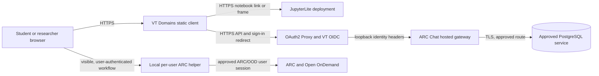

# CLAHS Common Platform onboarding packet

**Status:** draft for a platform onboarding discussion. This packet describes the
repository's current deployment contract and the decisions CLAHS and central IT
must supply. It intentionally contains no tenant names, hostnames, group IDs,
network ranges, Vault paths, or credentials that have not been assigned.

## Request

Provision a CLAHS development tenant for the ARC Chat control-plane gateway and
identify the process for requesting pre-production and production environments.
The gateway will initially support authenticated project and application
metadata, browser-workspace records, audit/events, and health/metrics endpoints.
It will not submit ARC jobs or deploy user applications until their approved
provider integrations are separately reviewed.

The static student interface belongs on the supplied VT Domains account. The
Common Platform should host the API and its durable metadata store; it should not
host user notebook files or research datasets.

## Current implementation

- `Dockerfile.gateway` builds a Python 3.12 gateway image from a digest-pinned
  base, installs only gateway dependencies, runs as UID/GID 10001, exposes port
  8080, and uses SIGTERM as its stop signal.
- The gateway serves `/health/live`, `/health/ready`, `/metrics`, and versioned
  `/api/v1` routes. Readiness checks PostgreSQL.
- The PostgreSQL schema stores users, projects, memberships, applications,
  workspaces, provider-resource references, jobs, endpoints, artifact metadata,
  deployments, idempotency state, audit events, and platform events. Research
  file bytes are not stored.
- The deployment renderer requires an immutable gateway image digest, exact
  HTTPS origins and OIDC callback, explicit network CIDRs, Vault-backed secret
  references, a TLS issuer, ingress class, and namespace values. It rejects
  missing or malformed values instead of supplying institutional defaults.
- Rendered gateway and OAuth proxy containers run non-root with read-only root
  filesystems, dropped capabilities, no privilege escalation, resource
  requests/limits, probes, and a restricted NetworkPolicy.
- CI builds the production image and exercises the API against PostgreSQL. A
  successful image build is not a substitute for an institutional registry
  scan, SBOM policy, or deployment review.
- The static client has no gateway origin configured yet. ARC actions remain
  unavailable in the hosted client until an approved delegation method exists.

See [`HOSTED_GATEWAY.md`](HOSTED_GATEWAY.md),
[`SECURITY_AND_DATA.md`](SECURITY_AND_DATA.md), and
[`hosted-gateway-openapi.yaml`](hosted-gateway-openapi.yaml) for implementation
details.

## Architecture and data flow



The API does not receive VT passwords, browser cookies, notebook contents, or
research files. The gateway derives an internal user identifier from the
validated immutable OIDC subject using an HMAC key. The raw subject is not
persisted. The proxy is the only public API entry point; identity headers are
trusted only from the configured in-pod proxy network.

The deployment must confirm whether the selected VT OIDC integration returns
the immutable subject, `mailPreferredAddress`, and `targetedMembership` claims
in the exact form expected by OAuth2 Proxy. Those claim names are configuration
targets, not verified institutional behavior yet.

## Environment request

Request separate `dvlp`, `pprd`, and `prod` configurations. Each environment
must have its own namespace, database or database schema/instance as approved,
OIDC client policy, secret references, hostname, network policy, and deployment
values. Development credentials must not grant production access. Do not apply
production manifests until the platform operator has reviewed the generated
objects.

| Value to assign | dvlp | pprd | prod | Owner to confirm |
| --- | --- | --- | --- | --- |
| Tenant ID and namespace | TBD | TBD | TBD | Common Platform |
| Gateway DNS name / ingress class | TBD | TBD | TBD | Common Platform + CLAHS |
| Gateway image registry and immutable digest | TBD | TBD | TBD | CLAHS + registry operator |
| PostgreSQL service, database, TLS mode, and allowed egress CIDR | TBD | TBD | TBD | Database/platform operator |
| Secret store, Vault path, and secret property names | TBD | TBD | TBD | Vault operator + CLAHS |
| OIDC issuer, client ID, secret reference, and exact callback | TBD | TBD | TBD | VT identity operator |
| Verified subject, email, and group claim/header mapping | TBD | TBD | TBD | VT identity operator + CLAHS |
| Static client origin | TBD | TBD | TBD | CLAHS |
| JupyterLite URL and allowed frame/connect policy | TBD | TBD | TBD | JupyterLite owner + CLAHS |
| ED group IDs and project/role mappings | TBD | TBD | TBD | Course/project owner |
| TLS issuer, certificate owner, and DNS process | TBD | TBD | TBD | Common Platform |
| Ingress, OIDC, database, and DNS egress ranges | TBD | TBD | TBD | Network/platform operator |
| CPU/memory requests and limits, replica count | TBD | TBD | TBD | Common Platform + CLAHS |
| Database backup, restore test, and retention owner | TBD | TBD | TBD | Database operator + CLAHS |
| Monitoring namespace, scrape policy, and alert route | TBD | TBD | TBD | Platform operator + CLAHS |
| Storage and persistence policy | TBD | TBD | TBD | Platform/database operator |

The current renderer uses a single operator-supplied values file per render.
Environment-specific values should remain separate files with reviewed values;
the same image digest and manifest source should be promoted through the
environments under the platform's release process.

## OIDC and browser contract

Register one callback per approved gateway hostname:

```text
https://<gateway-host>/oauth2/callback
```

Use the exact static site origin in the gateway's CORS policy and in the
generated static client's Content Security Policy. The OAuth proxy owns browser
sign-in and the secure HTTP-only session cookie. State-changing API calls also
require the session CSRF token, an allowed `Origin`, and an idempotency key.
Confirm the cross-site cookie behavior in the supported browser policy before
choosing unrelated static and gateway hostnames; third-party-cookie blocking can
break that arrangement.

Request only the identity claims needed for login and group-derived
authorization. Confirm the stable subject format, email header, group claim
format, group-size limit, logout behavior, session lifetime, and renewal policy
with the identity operator. Missing or changed group claims must fail closed.
The gateway must never implement a VT password form or store Duo/OOD cookies.

## Persistence, backup, and data boundary

The database is control-plane metadata only. Expected records include internal
user IDs, preferred email, project membership and role, application manifests,
workspace lifecycle and opaque provider references, resource requests, audit
events, deployment references, and event/idempotency records. Do not store
notebook cells, user file contents, VT credentials, OAuth tokens, SSH keys,
Jupyter authentication tokens, OOD cookies, or provider secrets.

The database owner and CLAHS must agree on encryption at rest/in transit,
backup frequency, point-in-time recovery if available, retention, restore-test
cadence, deletion/export workflow, incident access, and who is paged when
readiness fails. Production must have a demonstrated restore before user data
is retained. The API's metadata retention defaults are not an institutional
retention decision.

**Classification is not yet approved.** The example project manifest uses
`low` only as a fixture. Treat the pilot as metadata-only and do not place
regulated, restricted, sensitive, or research-file content in this service
until CLAHS and VT security classify the data flow. Keep research data in
approved JupyterLite browser storage, ARC storage, or an application-specific
approved store.

## Network and security requirements

- Public ingress: HTTPS only; HTTP, if accepted by the ingress controller, must
  redirect to HTTPS.
- Ingress reaches only the OAuth proxy Service port. The proxy forwards to the
  gateway over pod-local loopback. The gateway is not directly internet-facing.
- Egress is limited to DNS, the approved PostgreSQL endpoint/port, and the
  approved OIDC issuer/port. The platform must provide routable CIDRs or
  supported service selectors before rendering.
- JupyterLite is an external static service. The gateway does not proxy its
  notebook traffic.
- Disable service-account token mounting unless a reviewed platform integration
  needs it. No privileged pod, host network, writable root filesystem, or
  arbitrary shell endpoint is required.
- Set request and response size limits, cookie policy, rate limits, allowed
  origins, security headers, audit/log redaction, and ingress timeouts in the
  approved deployment.
- Run platform-approved vulnerability and dependency scans, generate an SBOM,
  and resolve policy findings before onboarding real users. The repository CI
  currently builds the image but does not claim those institutional scan gates
  have passed.

## Ownership proposal to confirm

| Area | CLAHS application team | Central IT / Common Platform |
| --- | --- | --- |
| Student static UI and JupyterLite integration | Own source, public configuration, accessibility, and release checks | Provide the assigned VT Domains account and hosting guidance |
| Gateway image and API | Own code, dependency updates, API security, releases, and app support | Provide the tenant, registry policy, deployment conventions, and platform support path |
| OIDC | Define required attributes, callback list, role mapping, and user flows | Register clients and confirm issuer/claims/session policy |
| PostgreSQL | Define schema, migration, metadata retention, and application recovery | Provide or approve database service, backup capability, and restore process |
| Secrets | Define required secret names and rotation behavior | Provide Vault/External Secrets integration, policies, and access audit |
| DNS/TLS/network | Supply reviewed hostname and traffic requirements | Approve DNS, ingress, certificates, CIDRs, and egress paths |
| Projects and course groups | Own project manifests, membership semantics, and course support | Provide identity groups and approved group synchronization behavior |
| Incident response | Own application triage, code rollback, user communication, and ARC coordination | Own platform/identity/database/network escalation and platform incidents |

This is a proposed boundary, not an accepted service agreement. Name a
technical owner, operational owner, support contact, and escalation path for
each environment before a pilot.

## Requested decisions and onboarding sequence

1. Approve a CLAHS `dvlp` tenant and name the service owner/operator.
2. Decide whether PostgreSQL is centrally provided or CLAHS operated, including
   backup and restore ownership.
3. Assign the dvlp namespace, tenant hostname, ingress/TLS process, secret
   store/Vault path process, and permitted network routes.
4. Confirm OIDC application registration, callback URI, claims, group mapping,
   cookie behavior, and logout policy.
5. Confirm data classification, pilot user population, group membership,
   metadata retention, audit retention, and deletion rules.
6. Agree on resource requests/limits, replica count, image registry, SBOM/scan
   gates, monitoring, logs, and deployment review process.
7. Provide a small, non-production acceptance environment and an approved
   restore test before considering pprd/prod.
8. Promote the same immutable image through `dvlp`, `pprd`, and `prod` only
   after the environment-specific review gates pass.

## First hosted acceptance milestone

The first deployment should demonstrate VT sign-in, authorized project listing,
project-scoped workspace metadata in PostgreSQL, audit/event creation, health
and logs, and recovery after gateway restart. It must reject a cross-project
read/write, survive a database-backed restart, and show no ARC mutation or
application deployment capability unless a separately reviewed adapter is
enabled.

