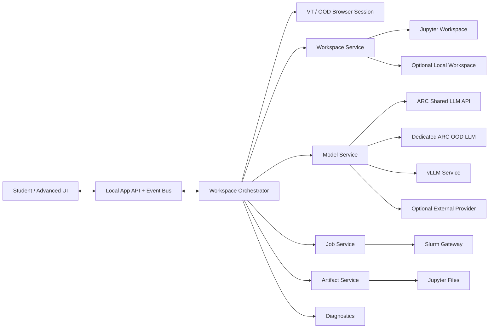

# ARC Chat: Technical Architecture and Product Plan

**Status:** Proposed architecture for discussion and implementation  
**Prepared by:** Alejandro Grenier  
**Date:** September 17, 2026  
**Audience:** Project contributors, Virginia Tech ARC/TLOS collaborators, instructors, and future maintainers

## 1. Executive summary

ARC Chat should become a low-friction research and programming environment that lets students use Python and AI without first learning the mechanics of HPC, while preserving a powerful advanced surface for users who do need direct access to ARC resources.

The central product decision is to build **one application with two deliberately different experiences**:

- **Student Mode** hides infrastructure. A student should think in terms of *workspace, prompt, code, run, files, and results*.
- **Advanced Mode** exposes the same underlying platform capabilities: allocations, Jupyter sessions, Slurm jobs, dedicated model services, vLLM, resource profiles, file pipelines, and diagnostics.

Both modes must sit on the same backend abstractions. Student Mode must not become a separate simplified codebase.

The current prototype already proves several difficult pieces: visible VT login/MFA through a browser, Open OnDemand navigation, Jupyter attachment, persistent remote Python execution, notebook persistence, streaming outputs, stdin, file transfer, model tool calls, explicit execution approval, and local-only helper security. The next step is therefore **not a ground-up rewrite**. It is a controlled architectural refactor that preserves working behavior while separating responsibilities and making the student experience radically simpler.

The desired end state is a platform that can support three increasingly powerful workflows:

1. **Classroom Python + ARC-hosted AI:** a nontechnical student can start a workspace, ask for a simple application or analysis, review generated Python, run it, and retrieve results.
2. **Research workbench:** an advanced user can manage ARC workspaces, files, models, jobs, and reusable workflows without manually stitching together OOD, Jupyter, Slurm, tunnels, and model endpoints.
3. **Application platform:** tools such as SUGAR or future research applications can consume ARC Chat's workspace/job/model services without being coupled to ARC Chat's UI.

The first implementation priority is classroom reliability. Advanced capabilities should be designed now, but added only after Student Mode is stable enough to support a real course deployment.

---

## 2. Current state

The repository currently consists of a self-contained HTML interface, a local Python `aiohttp`/Playwright/Jupyter helper, tests, and a macOS wrapper. This is an effective prototype architecture because it keeps authentication visible to the user and avoids deploying a new server-side service.

### 2.1 What already works

The existing helper provides:

- loopback-only local HTTP/WebSocket service;
- random per-process access token and Origin/Host checks;
- visible Chromium session for VT login and MFA;
- browser-assisted Open OnDemand navigation;
- Jupyter server discovery and attachment;
- persistent remote Python kernel execution;
- notebook persistence before and after execution;
- streamed stdout, rich output, errors, stdin, interruption, and reconnect behavior;
- local-to-remote file upload and remote-to-local download;
- OpenAI-compatible model calls;
- explicit review before model-proposed Python executes;
- no unattended agent execution loop;
- basic recovery from stale OOD/Jupyter connections;
- mock/unit tests and a local Jupyter integration test.

These are valuable primitives and should be retained.

### 2.2 Current architectural limitations

The prototype concentrates too many responsibilities in `Bridge` and exposes too much infrastructure directly in the UI.

`Bridge` currently owns browser lifecycle, ARC authentication state, OOD navigation, Jupyter REST/WebSocket transport, kernel lifecycle, notebook persistence, model calls, chat history, file transfer, execution approval state, and application event delivery. This makes behavior hard to test independently and makes future Slurm/vLLM features risky to add.

The HTML currently asks the user to understand or manipulate concepts such as:

- allocation account;
- Prepare Jupyter;
- Launch job;
- Connect ready session;
- kernel name;
- provider;
- API base URL;
- model ID;
- manual attach/detach;
- explicit OOD shutdown.

Those are appropriate diagnostics or Advanced Mode controls, but they are too much surface area for a student whose goal is simply to run Python and call an API.

Other immediate concerns:

- a professor-specific allocation is currently prefilled and should not be a public default;
- model IDs are hard-coded even though ARC changes the hosted catalog over time;
- custom HTTPS endpoints are accepted with little policy separation between ordinary and expert use;
- local session state is largely in-memory, so helper restart recovery is limited;
- macOS still depends on a local Python installation and first-run dependency/browser downloads;
- Windows has no first-class packaged launcher yet;
- classroom support at the scale of hundreds of students requires diagnostics, backpressure handling, and deployment testing beyond the current prototype.

---

## 3. Product goals

### 3.1 Primary goals

1. **A first-time student can succeed without Terminal.**
2. **Student Mode requires no knowledge of Slurm, Jupyter internals, ports, kernels, resource flags, or model endpoints.**
3. **Every code execution or privileged infrastructure mutation remains user-authorized.**
4. **Authentication remains visible and respects VT MFA/VPN requirements.**
5. **The application can recover from common network, OOD, and Jupyter failures without replaying code.**
6. **The same backend can power both Student and Advanced modes.**
7. **Advanced Mode can eventually submit/manage Slurm jobs and launch dedicated model services, including vLLM.**
8. **External research applications can eventually consume workspace, model, job, and artifact services through stable interfaces.**
9. **Classroom releases are reproducible, self-contained, diagnosable, and supportable at course scale.**
10. **The design is general enough for use outside FL 2744 without making the first classroom deployment wait for every advanced feature.**

### 3.2 Non-goals

The application should not:

- bypass VT login, MFA, VPN, allocations, or ARC resource policies;
- become a general autonomous coding agent that can run arbitrary commands without confirmation;
- attempt to replace Open OnDemand, Jupyter, or Slurm;
- store VT passwords;
- require a central ARC Chat web service for the first production version;
- expose infrastructure complexity merely because it exists;
- couple SUGAR or another application directly into the ARC Chat repository;
- guarantee that any arbitrary third-party model endpoint is safe or compatible;
- treat a 240-student rollout as equivalent to a successful single-machine demo.

---

## 4. Product model: one engine, two experiences

### 4.1 Student Mode

Student Mode is the default. The visible concepts should be approximately:

- **Workspace**
- **Ask**
- **Code**
- **Run**
- **Results**
- **Files**

The normal flow should be:

```text
Open ARC Chat
    ↓
Course/profile check
    ↓
Start Workspace
    ↓
Visible VT login/MFA if needed
    ↓
ARC workspace prepared with safe course defaults
    ↓
AI: Virginia Tech ARC — Connected
Python: ARC Workspace — Ready
    ↓
Ask → review proposed code → Run → inspect result → iterate
```

Student Mode should not normally expose:

- raw allocation names;
- cluster selectors;
- Jupyter URLs;
- kernel IDs;
- API base URLs;
- raw model IDs unless an instructor intentionally enables selection;
- Slurm flags;
- vLLM parameters;
- custom endpoint configuration;
- manual attach/detach controls.

When a student action requires a real infrastructure decision, the application should use an instructor/course profile and show a human-readable confirmation instead of raw fields.

Example:

> **Start course workspace**  
> Uses the FL 2744 course compute profile. You may be asked to sign into Virginia Tech and approve the ARC job launch.

### 4.2 Advanced Mode

Advanced Mode reveals the underlying capabilities in a structured way rather than exposing prototype/debug controls.

Proposed sections:

- **Workspace** — ARC/local workspace lifecycle, kernels, sessions, allocations.
- **Jobs** — Slurm templates, submission, status, logs, cancel/relaunch.
- **Models** — ARC shared models, dedicated OOD models, vLLM services, custom compatible endpoints.
- **Files & Artifacts** — remote files, generated results, transfers, artifact provenance.
- **Pipelines** — pass outputs between programs/jobs/services.
- **Diagnostics** — connection state, versions, endpoints, sanitized support bundle.
- **Settings** — course profile, advanced resource defaults, security choices.

Advanced Mode is not a different backend. It is a more detailed projection of the same application state and capabilities.

---

## 5. Target architecture

The current `Bridge` should be decomposed incrementally into services with explicit interfaces. `aiohttp` and the local browser-based architecture can remain.



### 5.1 Proposed package structure

This is a target structure, not a requirement to move every file in one commit.

```text
arc_chat/
  app.py                  # local server startup/lifecycle
  protocol.py             # command/event envelopes and validation
  state.py                # authoritative application state machine
  orchestrator.py         # high-level user actions

  auth/
    ood_browser.py         # visible Playwright VT/OOD session

  workspace/
    base.py                # Workspace interface
    jupyter.py             # Jupyter REST/WebSocket implementation
    local.py               # optional local execution backend
    notebook.py            # notebook persistence

  models/
    base.py                # ModelProvider interface
    arc_shared.py          # llm-api.arc.vt.edu
    arc_dedicated.py       # dedicated OOD LLM session
    openai_compatible.py   # advanced compatible endpoint
    catalog.py             # capabilities/catalog discovery + fallback

  jobs/
    base.py                # JobBackend interface
    slurm.py               # ARC Slurm gateway
    profiles.py            # safe resource profiles

  services/
    vllm.py                # vLLM job/service lifecycle

  artifacts/
    store.py               # artifact metadata/provenance
    transfer.py            # upload/download

  config/
    profiles.py            # course and user profiles

  security/
    secrets.py             # in-memory/keychain secret store
    network.py             # endpoint policy and validation
    redaction.py           # structured secret redaction

  diagnostics/
    doctor.py              # self-test and sanitized support report

  ui/
    ...                    # static frontend assets
```

---

## 6. Authoritative state machine

The application should stop inferring state from a collection of independent booleans and object references.

Suggested internal states:

```text
APP_STARTING
READY_LOCAL
AUTH_REQUIRED
AUTHENTICATING
ARC_READY
WORKSPACE_STARTING
JOB_QUEUED
JUPYTER_STARTING
WORKSPACE_READY
EXECUTING
INPUT_REQUIRED
RECOVERING
DEGRADED
ERROR
SHUTTING_DOWN
```

The UI should map those into a much smaller vocabulary:

- **Starting**
- **Sign in required**
- **Starting workspace**
- **Ready**
- **Running**
- **Needs attention**

Every mutating command should have:

- request ID;
- explicit preconditions;
- defined state transition;
- idempotency behavior;
- structured error code;
- user-facing recovery action.

This is especially important for course use: reconnecting a UI or double-clicking a button must not submit duplicate jobs or replay Python.

---

## 7. Local protocol

The current WebSocket event mechanism is worth keeping, but the protocol should be versioned and typed.

Example command:

```json
{
  "version": 1,
  "id": "request-uuid",
  "type": "command",
  "action": "workspace.start",
  "payload": {"profile": "fl2744"}
}
```

Example event:

```json
{
  "version": 1,
  "type": "state",
  "state": "WORKSPACE_READY",
  "display": "Ready"
}
```

Example structured error:

```json
{
  "version": 1,
  "type": "error",
  "code": "ARC_VPN_UNREACHABLE",
  "message": "ARC cannot be reached from this network.",
  "recovery": "Connect to the VT VPN and try again."
}
```

On UI reconnect, the backend should send a complete state snapshot rather than relying on the browser to reconstruct state from prior events.

---

## 8. Workspace abstraction

A `Workspace` is the environment in which user code executes and files live.

Minimum interface:

```python
class Workspace:
    async def start(profile): ...
    async def status(): ...
    async def execute(code): ...
    async def interrupt(): ...
    async def list_files(path=""): ...
    async def upload(...): ...
    async def download(...): ...
    async def stop(): ...
```

### 8.1 ARC Jupyter workspace

The first production backend should remain the current Jupyter implementation because it already works and provides persistent variables, notebooks, rich output, stdin, and file access.

The refactor should preserve:

- source saved before execution;
- output saved after execution;
- parent-message filtering;
- reconnect without replay;
- busy-kernel protection;
- explicit interrupt;
- notebook provenance.

### 8.2 Optional local workspace

A local Python backend is worth designing for even if it is not the first implementation.

Why:

- ARC's shared LLM API is available to VT users without a separate ARC HPC account;
- introductory API-building exercises may not require HPC resources;
- a local backend gives a graceful fallback when a course allocation or OOD is unavailable;
- the same Student Mode can therefore teach Python/API use before students need remote compute.

Local execution must remain sandbox-conscious and should never silently substitute for ARC when an instructor requires ARC execution. Course profiles should control which backends are allowed.

---

## 9. ARC authentication and Open OnDemand

The visible Playwright browser is a strong security/product choice and should remain the default authentication mechanism until ARC provides a better supported integration path.

Principles:

- never collect VT passwords in ARC Chat;
- never bypass MFA;
- do not persist browser authentication profiles by default;
- reuse the active browser session during a run;
- tolerate OOD label/layout drift;
- always provide a visible manual fallback;
- isolate OOD automation behind an adapter so UI changes do not contaminate workspace/model code.

### 9.1 Course profiles

Remove public hard-coded personal allocation values.

Instead, support a course profile such as:

```yaml
id: fl2744
name: FL 2744
workspace_backend: arc_jupyter
cluster: falcon
allocation: ${ARC_COURSE_ALLOCATION}
resource_profile: classroom-small
model_provider: arc_shared
model_policy: instructor_default
advanced_mode: optional
```

The real allocation value can be injected by an instructor-distributed configuration, environment variable, or future managed configuration mechanism rather than committed to the public repository.

Student Mode should translate the profile into a single high-level action: **Start Workspace**.

---

## 10. Model architecture

ARC Chat should treat model access as a service independent from code execution.

### 10.1 Supported model sources

#### A. ARC shared hosted API

Default for Student Mode.

Current documented endpoint:

`https://llm-api.arc.vt.edu/api/v1`

Current primary models include:

- `gpt-oss-120b`
- `DeepSeek-V4.1-Flash`
- `GLM-5.3`
- `Kimi-K3`

ARC also exposes reasoning variants and additional capabilities such as embeddings. The hosted model catalog is explicitly dynamic, so model IDs should not be treated as permanent application constants.

Reference: https://docs.arc.vt.edu/ai/011_llm_api_arc_vt_edu.html

#### B. Dedicated ARC LLM via Open OnDemand

Advanced Mode should support ARC's dedicated OOD LLM sessions as a managed provider. These sessions consume allocation resources and expose a per-session API key/endpoint.

Reference: https://docs.arc.vt.edu/ai/020_ood_arc_vt_edu.html

#### C. Custom vLLM service

Advanced Mode should eventually launch and manage user-controlled vLLM instances through Slurm. ARC documents use of `/common/data/models/` and custom Slurm scripts for serving.

Reference: https://docs.arc.vt.edu/ai/030_vllm.html

#### D. External OpenAI-compatible provider

Useful for advanced/research scenarios, but not necessary in the default course experience. Data leaving Virginia Tech must be obvious to the user.

### 10.2 Model catalog service

Create a `ModelCatalog` abstraction that supports:

- runtime capability/model discovery where the endpoint supports it;
- a versioned fallback catalog when discovery is unavailable;
- manual model ID entry in Advanced Mode;
- capability metadata such as tool calling, vision, embeddings, context size, reasoning modes;
- graceful handling when ARC adds or removes models.

Student Mode should normally display something like:

> **AI: Virginia Tech ARC — Connected**

rather than an endpoint and raw model field.

### 10.3 Rate limits and class-scale backpressure

A 240-student class creates burst behavior that a single-user prototype does not encounter.

Model calls must:

- recognize HTTP 429 and transient 5xx responses;
- honor `Retry-After` when supplied;
- use bounded exponential backoff with jitter;
- never duplicate a tool execution while retrying a model request;
- expose a friendly `ARC is busy; your request is queued/retrying` status;
- allow instructor/course defaults to distribute load across appropriate models if ARC recommends it.

Before a full course launch, expected class-time concurrency should be reviewed with ARC personnel.

---

## 11. Agent/tool execution model

The current explicit approval model is a feature and should remain a core invariant.

### 11.1 Student Mode

Model may propose:

- Python execution;
- file creation/modification inside the active workspace;
- safe analysis steps.

Every executable/mutating proposal requires a user click.

There is **no autonomous loop**.

### 11.2 Advanced Mode

Future tool capabilities may include:

- `run_python`
- `read_artifact`
- `write_artifact`
- `submit_job`
- `cancel_job`
- `launch_vllm`
- `stop_service`
- `run_pipeline_step`

Each tool should carry a risk class:

- **read-only** — status/list operations;
- **workspace mutation** — file writes or code execution;
- **resource mutation** — job submit/cancel, service start/stop;
- **external network** — calls that send data outside VT.

Workspace/resource/external mutations require explicit approval. The UI should explain what will happen, not merely show a tool name.

---

## 12. Slurm architecture

Slurm support should be built behind a `JobBackend` abstraction rather than by sprinkling `sbatch` commands through the UI or model prompt.

Minimum interface:

```python
class JobBackend:
    async def submit(spec): ...
    async def status(job_id): ...
    async def logs(job_id): ...
    async def cancel(job_id): ...
    async def list_active(): ...
```

A `JobSpec` should support both high-level profiles and an Advanced Mode raw-script escape hatch.

Example high-level profile:

```yaml
id: gpu-small
cpus: 4
memory_gb: 32
gpus: 1
walltime: "01:00:00"
```

The transport used to reach Slurm should be isolated behind a gateway and selected after ARC testing/consultation. Possibilities include submission from an authorized ARC-side workspace or a future supported ARC/OOD integration. The application should not assume a brittle mechanism before it is validated with ARC.

Student Mode should not display raw Slurm parameters.

---

## 13. vLLM service management

vLLM should be implemented as a managed service built on the job layer.

Conceptual lifecycle:

```text
Choose model/profile
    ↓
Resolve ARC model path
    ↓
Generate reviewed Slurm job
    ↓
Submit
    ↓
Wait for RUNNING
    ↓
Wait for health endpoint
    ↓
Register model endpoint as service
    ↓
Use from ARC Chat / another application
    ↓
Stop service → cancel job
```

The first implementation should prefer models already available under ARC's shared model storage as documented by ARC rather than downloading large duplicate copies.

A key design question is endpoint reachability. The service registry must distinguish:

- endpoint reachable directly from the local application;
- endpoint reachable only from ARC compute;
- endpoint requiring an approved tunnel/proxy mechanism.

ARC Chat should not invent insecure port exposure. If a vLLM instance is only reachable inside ARC, model calls can be relayed through the active ARC workspace until a supported direct-access method is established.

---

## 14. Artifacts and pipelines

Will's idea of passing outputs between programs becomes much easier if ARC Chat treats generated outputs as first-class artifacts rather than anonymous files.

Suggested artifact record:

```json
{
  "id": "artifact-uuid",
  "type": "file",
  "path": "results/report.csv",
  "workspace": "workspace-id",
  "created_by": "python-cell-or-job-id",
  "created_at": "...",
  "media_type": "text/csv",
  "metadata": {}
}
```

Benefits:

- output from one program can become input to another without the user manually copying paths;
- job provenance becomes visible;
- a future pipeline UI can connect steps through artifact IDs;
- external applications can exchange outputs through a stable contract;
- support/debugging becomes easier because the app knows what produced a result.

A later pipeline might look like:

```text
Upload dataset
 → Python cleaning
 → Slurm analysis job
 → generated CSV
 → visualization step
 → report artifact
```

The application should orchestrate these steps, but each execution/resource mutation remains reviewable.

---

## 15. Security model

Security is a product requirement, especially if ARC Chat becomes institutional software.

### 15.1 Local helper

Retain and test:

- bind only to `127.0.0.1`;
- random high-entropy session token;
- Host validation;
- Origin validation;
- no-store responses;
- authenticated WebSocket path;
- no remote listener by default.

### 15.2 Secrets

Create a centralized `SecretStore` so all sensitive values are tracked and redacted consistently.

Default behavior:

- secrets remain in memory;
- never write API keys into notebooks, logs, chat transcripts, or diagnostic bundles;
- redact every registered secret from errors/events;
- clear secrets on explicit sign-out/quit.

Optional convenience later:

- macOS Keychain;
- Windows Credential Manager;
- opt-in persistent storage only;
- clear UI explaining where a key is stored.

ARC API keys are personal and must never be shared between students.

### 15.3 Endpoint policy

Student Mode should be allowlisted to VT ARC services required by the course.

Advanced custom endpoints should:

- require HTTPS except explicit localhost development;
- clearly identify whether data leaves Virginia Tech;
- block accidental private/link-local/internal destinations unless explicitly required by a trusted ARC integration;
- never silently send a stored ARC/OpenAI credential to a different host.

### 15.4 Model/data boundary

The UI should make the boundary explicit:

- Python executes in the selected workspace;
- only selected chat messages/tool outputs are sent to the configured model service;
- external providers mean data leaves VT;
- ARC shared models are on-premises but interactions are logged under VT policy;
- files and tool outputs are untrusted content, not instructions.

### 15.5 Privileged action approval

The model cannot directly:

- submit/cancel a Slurm job;
- start/stop a model service;
- execute proposed code;
- send workspace data to an external provider;

without a user-visible approval step.

---

## 16. Reliability and recovery

The application should be designed around the assumption that browsers, VPN connections, OOD sessions, compute jobs, and WebSockets fail.

Required recovery behavior:

- local UI reconnect does not restart or replay work;
- Jupyter WebSocket reconnect reuses the existing kernel when safe;
- execution connection loss reports `execution state unknown` and requires inspection rather than replay;
- stale OOD/Jupyter endpoint can be replaced without deleting files;
- helper restart can offer to rediscover/resume a prior workspace after reauthentication;
- duplicate `Start Workspace` or `Run` requests are suppressed;
- job submission has a durable request/job ID before the UI reports success;
- long operations expose progress and cancellation where safe.

### 16.1 Non-secret session persistence

Persist a small versioned local state file containing only non-secret metadata such as:

- app version;
- last course profile;
- active workspace identifier;
- notebook path;
- known job ID;
- UI preferences;
- optional transcript path.

Do not persist browser cookies or API keys in this file.

---

## 17. Diagnostics and support

For a 240-student course, diagnostics are not optional.

Add an `ARC Chat Doctor` that checks:

- supported OS/app version;
- packaged runtime health;
- loopback server/token state;
- browser automation availability;
- VT/ARC reachability;
- OOD sign-in state;
- course profile validity;
- allocation visibility where applicable;
- Jupyter reachability;
- model API reachability;
- model selection/capability;
- remote file write test;
- kernel execution smoke test.

The user should be able to click **Copy Support Report** or **Export Diagnostic Bundle**.

The report must exclude:

- API keys;
- VT credentials/cookies;
- chat content;
- notebook contents;
- arbitrary user file contents.

It may include:

- app/build version;
- OS/architecture;
- sanitized state transitions;
- HTTP status/error classes;
- selected profile/model name;
- relevant job/session IDs if safe;
- timestamps;
- dependency versions.

This is likely one of the highest-leverage features for instructors and ARC/TLOS support staff.

---

## 18. Distribution and releases

The classroom version should not require students to install Python, create a virtual environment, run pip, or download Chromium on first launch.

### 18.1 Supported initial targets

- Windows 11 x64 (Windows 10 if practical and tested)
- macOS 13+ Apple Silicon
- macOS 13+ Intel while there is meaningful demand

Linux can remain an advanced/manual path initially.

### 18.2 Packaging goals

Bundle:

- Python runtime;
- application code;
- static UI;
- required Python dependencies;
- compatible Playwright browser/runtime assets.

Release automation should build cleanly on CI runners and produce:

- Windows portable package and/or installer;
- macOS Apple Silicon package;
- macOS Intel package;
- checksums;
- version metadata;
- smoke-test results.

Before institutional distribution, pursue proper code signing/notarization with Virginia Tech guidance rather than relying indefinitely on ad-hoc signing.

### 18.3 Update strategy

Do not implement silent auto-update initially. Prefer:

- visible version/build number;
- `Check for update` link;
- instructor-controlled course version guidance;
- forward-compatible state/config migrations.

---

## 19. UI design

### 19.1 Student dashboard

Suggested default screen:

```text
ARC Chat

Course: FL 2744                              Settings

Workspace             AI
● Ready               ● Virginia Tech ARC — Connected

[ Ask what you want to build or analyze...                    ]
[ Send ]

Assistant
-------------------------------------------------------------
...

Proposed Python
-------------------------------------------------------------
...
[ Run ]   [ Edit ]   [ Reject ]

Results
-------------------------------------------------------------
...

[ Files ] [ Download results ]
```

Infrastructure should appear only when it needs attention.

Example error:

> **Workspace needs attention**  
> Your ARC session has ended. Your saved files were not deleted.  
> **Reconnect workspace**

not:

> Jupyter HTTP 503 at `/pun/sys/dashboard/...`

The detailed error belongs in Diagnostics.

### 19.2 First-run setup

Student first-run wizard:

1. Verify packaged app/runtime.
2. Identify course profile.
3. Explain that VT login/MFA occurs in a separate browser.
4. Obtain or verify personal ARC model API key.
5. Test ARC AI connection.
6. Start/test workspace if the course requires ARC compute.
7. Show a successful `print("Hello from ARC")` smoke test.

After that, normal launches should go directly to the dashboard.

### 19.3 Advanced mode discovery

Advanced Mode should be visible but not intrusive:

> **Advanced tools**  
> Jobs, resource profiles, model services, endpoints, and diagnostics.

No hidden keyboard shortcut or separate application should be required.

---

## 20. Testing strategy

Testing should be layered so most failures can be found without a live ARC account.

### 20.1 Unit tests

Cover:

- URL/endpoint policy;
- protocol validation;
- state transitions;
- request idempotency;
- secret redaction;
- model catalog fallback;
- job-spec validation;
- artifact metadata;
- notebook message framing;
- Jupyter output correlation;
- file path/name validation;
- course profile validation.

### 20.2 Mock integration tests

Simulate:

- OOD browser pages and label changes;
- Jupyter REST server;
- Jupyter kernel WebSocket;
- ARC model API success/429/5xx/tool calls;
- workspace reconnect;
- UI reconnect;
- duplicate requests;
- dropped execution connection;
- Slurm job lifecycle once that module exists.

### 20.3 Local real integration tests

Retain a real local Jupyter integration test for:

- kernel execution;
- persistent variables;
- stdin;
- errors;
- notebook persistence;
- file transfer;
- reconnect behavior.

### 20.4 ARC acceptance tests

Run a controlled acceptance checklist with authorized ARC users for:

- VT login/MFA;
- on-campus and VPN access;
- OOD label/form changes;
- account/allocation selection;
- job queue behavior;
- Jupyter connection;
- ARC model API tool calling;
- rate limiting;
- session expiration;
- course profile;
- shutdown/resource release.

Live ARC behavior should never be inferred solely from mocks.

### 20.5 Release gates

A classroom release should require:

- unit/mock suite green;
- local Jupyter integration green;
- packaged Windows smoke test green;
- packaged Apple Silicon smoke test green;
- Intel Mac smoke test when supported;
- `Doctor` green on at least one clean machine per platform;
- no known secret leakage;
- release notes and rollback path.

---

## 21. Performance and reliability targets

These are initial engineering targets, not contractual SLAs.

For supported clean machines:

- **≥95% first-run setup success** without Terminal intervention in a small pilot;
- **≥99% repeat-launch success** after successful setup;
- **<3 minutes median** from launch to ready remote workspace after user authentication under normal ARC queue conditions;
- **<90 seconds median** repeat connection when an appropriate workspace is already available;
- UI reconnect must never replay code;
- no duplicate job submission from duplicate UI actions;
- diagnostics generated in <10 seconds excluding network/remote checks;
- secrets absent from normal logs and support bundles;
- student mode contains no required raw endpoint/URL/kernel fields.

For course scale, load testing should focus on burst behavior rather than only average latency.

---

## 22. Course-scale deployment dependencies

A 240-student rollout has institutional dependencies that software alone cannot solve.

Before full deployment, confirm with ARC/TLOS/instructor stakeholders:

1. whether every student will have an ARC account;
2. how course allocation membership is provisioned;
3. expected maximum concurrent Jupyter jobs;
4. recommended CPU/memory/walltime profile for introductory work;
5. idle-session/resource cleanup expectations;
6. hosted LLM API burst/concurrency expectations during class;
7. preferred model for course exercises;
8. whether ARC/TLOS can support code signing or managed distribution;
9. support/escalation route when ARC itself is unavailable;
10. acceptable data categories for course exercises.

These should be tracked as explicit deployment requirements rather than discovered during a 240-person class session.

---

## 23. Implementation roadmap

### Phase 0 — Preserve and measure the prototype

**Goal:** establish a safe refactor baseline.

Deliverables:

- tag/reference known-good prototype;
- expand tests around existing behavior;
- add build/version identifier;
- document current state transitions and network boundaries;
- remove professor-specific allocation default from public UI;
- introduce structured error codes without changing normal behavior.

Exit criteria:

- all current functional tests pass;
- current macOS workflow remains usable;
- no user-visible regression in existing advanced/manual workflow.

### Phase 1 — Student Mode foundation

**Goal:** make the ordinary workflow understandable to a non-CS student.

Deliverables:

- application state machine;
- workspace orchestrator;
- course profile support;
- Student/Advanced mode switch;
- Student dashboard with `Start Workspace`;
- ARC shared model quick setup;
- hide allocation/kernel/URL/endpoint details by default;
- structured recovery messages;
- `ARC Chat Doctor` first version.

Exit criteria:

- first-time user can reach `Hello from ARC` following only in-app instructions;
- no terminal required after installation;
- no raw infrastructure field is required in Student Mode.

### Phase 2 — Classroom distribution

**Goal:** make installation/support realistic for a course.

Deliverables:

- self-contained Windows build;
- self-contained Apple Silicon macOS build;
- Intel build if required;
- bundled dependencies/browser runtime;
- release CI;
- diagnostic export;
- update/version messaging;
- rate-limit/backoff handling.

Exit criteria:

- 5–10 clean-machine pilot reaches ≥95% first-run success;
- no student installs Python manually;
- support report is sufficient to diagnose common failures.

### Phase 3 — Course pilot

**Goal:** validate actual student behavior before 240-person use.

Deliverables:

- small FL 2744 pilot;
- usability observations;
- error/failure taxonomy;
- improved first-run copy;
- ARC capacity feedback;
- course exercise templates.

Exit criteria:

- students with little/no CS background can independently complete a simple Python + LLM API exercise;
- common failures have explicit recovery paths;
- ARC/TLOS stakeholders have reviewed capacity and support assumptions.

### Phase 4 — Advanced workspace and job layer

**Goal:** expose real ARC power without compromising Student Mode.

Deliverables:

- Advanced Mode navigation;
- workspace inspector;
- resource profiles;
- `JobBackend` abstraction;
- Slurm submit/status/log/cancel after validating the ARC transport;
- job history and artifact linkage.

Exit criteria:

- advanced user can submit and monitor a reviewed job without manually composing routine Slurm boilerplate;
- Student Mode remains unchanged.

### Phase 5 — Dedicated models and vLLM

**Goal:** manage research-grade model services.

Deliverables:

- dedicated OOD LLM provider;
- vLLM service specification;
- Slurm script generation;
- model-path resolution using ARC shared model storage;
- service health/lifecycle;
- endpoint registry;
- explicit resource/cost visibility.

Exit criteria:

- advanced user can start a reviewed model service, use it, and stop/release its resources from ARC Chat;
- no insecure port exposure or hidden background allocation.

### Phase 6 — Artifacts, pipelines, and application integration

**Goal:** make ARC Chat a platform rather than only a chat interface.

Deliverables:

- artifact registry/provenance;
- pipeline graph/step model;
- output-to-input handoff;
- stable local/programmatic service interfaces;
- example external application integration.

A tool such as SUGAR can be used as an integration demonstration, but must remain a separate repository/product.

Exit criteria:

- one external application can request/use ARC resources through documented interfaces without importing ARC Chat UI code;
- pipeline steps are reproducible and traceable.

### Phase 7 — Institutional hardening

**Goal:** prepare for use beyond one course.

Deliverables:

- stakeholder-reviewed security/data documentation;
- signed/notarized distributions;
- contributor/governance policy;
- licensing decision;
- accessibility review;
- support ownership/escalation model;
- versioned configuration profiles;
- release lifecycle and deprecation policy.

---

## 24. Recommended first development pass

The first substantial PR after this plan should **not** attempt Slurm or vLLM yet.

Recommended scope:

1. Introduce `AppState` / explicit state machine.
2. Extract current Jupyter functionality from `Bridge` into a `JupyterWorkspace` without changing behavior.
3. Extract ARC/OOD browser automation into its own adapter.
4. Extract model calls into an `ArcSharedModelProvider`/provider interface.
5. Remove the hard-coded personal allocation from the public UI.
6. Add a course-profile/config abstraction.
7. Add Student Mode shell with a single **Start Workspace** path.
8. Preserve the current detailed interface as Advanced Mode during the transition.
9. Add `Doctor` with local/runtime/model/Jupyter checks.
10. Expand tests around all extracted interfaces and state transitions.

That PR would create the architecture needed for every later feature while immediately improving the classroom experience.

---

## 25. Immediate technical issues to inspect during implementation

The following deserve explicit review as the refactor begins:

- path traversal and remote file-scope assumptions;
- arbitrary/custom provider SSRF and credential-host binding;
- complete secret redaction, including multiple simultaneously configured keys;
- stale Playwright cookies/session lifecycle;
- OOD selector resilience and manual fallback;
- multiple Jupyter server disambiguation;
- model compatibility with tool calling;
- output/context truncation strategy;
- context-window accounting;
- HTML/rich-output sandboxing;
- notebook/session resume after helper restart;
- file upload limits and large-project workflow;
- rate-limit behavior at classroom scale;
- one-active-client vs multiple-browser-tab behavior;
- packaging/runtime update failures;
- dependency pinning and reproducible builds;
- code signing/notarization;
- local diagnostic/log retention policy;
- accessibility/keyboard navigation;
- handling of ARC outage vs local application failure;
- course allocation exhaustion and idle resource cleanup.

---

## 26. Design invariants

These should remain true as the project grows:

1. **Student Mode is simpler after each release, not more complicated.**
2. **Advanced capability does not leak into the default workflow.**
3. **Authentication is never hidden or bypassed.**
4. **The model never receives authority to execute code or allocate resources without human approval.**
5. **Connection recovery never silently replays code.**
6. **Secrets are never included in notebooks, logs, diagnostics, or transcripts by default.**
7. **Infrastructure-specific behavior is behind interfaces, not embedded in UI code.**
8. **Course-specific configuration is data, not hard-coded application behavior.**
9. **Real ARC behavior is validated with ARC; mocks do not substitute for acceptance testing.**
10. **External applications integrate through stable contracts rather than repository coupling.**
11. **Every running allocation/service has a visible owner, status, and stop/release path.**
12. **The application remains useful even when a sophisticated feature is unavailable.**

---

## 27. Success criteria

The project is succeeding when a student with no prior CS/HPC experience can:

1. install/open ARC Chat;
2. authenticate using normal VT mechanisms;
3. start a course workspace;
4. obtain/connect a personal ARC model API key;
5. describe a small program in natural language;
6. understand that code has been proposed but not yet executed;
7. approve/run the code;
8. see and download the result;
9. recover from a dropped connection using an obvious action;
10. finish without learning Slurm or Jupyter administration.

At the same time, an advanced researcher should eventually be able to use the same application to:

1. choose an ARC project/allocation and resource profile;
2. manage workspaces and files;
3. submit and inspect Slurm jobs;
4. launch a dedicated model/vLLM service;
5. pass artifacts between programs;
6. expose those resources to a separate research application;
7. understand exactly what resources are running and how to release them.

That combination — **simple default experience, serious underlying capability** — is the core technical and product direction for ARC Chat.

---

## 28. External references

- ARC LLM API: https://docs.arc.vt.edu/ai/011_llm_api_arc_vt_edu.html
- ARC dedicated LLMs through Open OnDemand: https://docs.arc.vt.edu/ai/020_ood_arc_vt_edu.html
- ARC vLLM guidance: https://docs.arc.vt.edu/ai/030_vllm.html
- ARC Open OnDemand documentation: https://docs.arc.vt.edu/resources/ood.html
- Jupyter Server REST API: https://jupyter-server.readthedocs.io/en/latest/developers/rest-api.html
- Jupyter messaging protocol: https://jupyter-client.readthedocs.io/en/stable/messaging.html
- Playwright authentication/browser contexts: https://playwright.dev/python/docs/auth

---

## 29. Decision log for the first implementation cycle

Unless stakeholder review changes them, begin with these assumptions:

- keep the local helper + browser UI architecture;
- keep Playwright-visible VT authentication;
- keep Jupyter as the first ARC execution backend;
- make ARC shared hosted models the Student Mode default;
- preserve explicit human approval for every code execution;
- build Student and Advanced modes over one backend;
- remove public personal-allocation defaults;
- introduce course profiles before adding more hard-coded course logic;
- build diagnostics before attempting a large student rollout;
- define Slurm/vLLM interfaces now, implement them after Student Mode is stable and ARC transport/capacity assumptions are validated;
- keep SUGAR and other applications separate and integrate later through stable interfaces.

This plan should be treated as a living architecture document. Major changes should update the relevant decision, rationale, and migration impact rather than allowing implementation to drift silently away from the design.